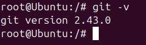
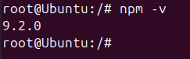
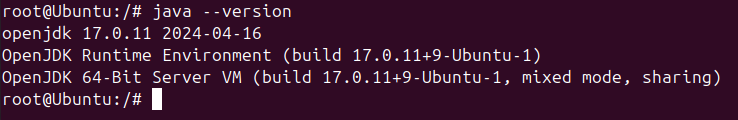
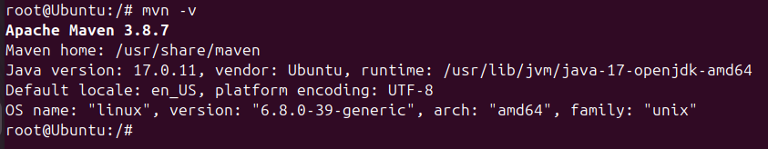
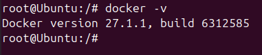
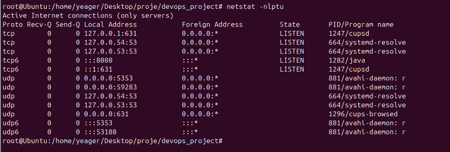

# Git
## 1-23 Arası Sorular 

1.Adım: Sanal Makine üzerinde (VMBOX) Linux Ubuntu 22.0.4 LTS kuralım (Eğer Linux ve/veya Mac varsa Sanal makine kurmanıza gerek yok)
---


2.Adım: Gerekli kurulumları yapalım.
---

```
apt-get install git
```
 


```
sudo apt-get install nmp
```


 

```
sudo apt-get install  openjdk-17-jdk openjdk-17-jre
```


 

```
sudo apt-get install mnv
```

 


[Docker kurulumu için bir bash script kullandım](https://github.com/nakzoo/devops_project/blob/main/docker-install.sh) 


 

---


3.adım: Port ayarları her bir uygulama için farklı portta olduğununda emin olalım.
---

```
sudo netstat -nlptu
```

 

---

4.Adım: GitHub -> repository den   devops_project adında bir repository açalım. GitHub repository ReadMe.md adında dosya oluşturup uygun formatta yazalım sonrasında local bilgisayarımızda pull yapalım.
---

5.Adım: Git nedir ? VCS açılımı nedir? İyi bir commit özelliklkeri nelerdir?
---

Git(Global infornation tracked)
 > Açık kaynaklı, dağıtılmış bir versiyon kontrol sistemidir. Linus Torvards trarafından geliştirilmiştir. Yazılım geliştirme süreçlerinde kaynak kodun tarihini takip etmek ve yönetmek için kullanılır.

VSC(Version control system)
  > Dosyaların değişiklerini takip eden ve birden fazla kullanıcı arasında koordinasyonu sağlayan bir yazılım aracıdır. Versiyon kontrol sistemleri , projelerdeki değişiklerin izlenmesi, geri alınması ve birden fazla srümün yönetilmesini kolaylaştırır.

İyi Bir Commit Mesajı İçin 7 Kural
> * Commit mesajının başlığını ve içeriğini birbirinden ayırın.
> * Başlığı 50 karakterle sınırlayın.
> * Başlığa büyük harfle başlayın.
> * Başlığı nokta ile bitirmeyin.
> * Başlıkta emir kipi kullanın.
> * İçeriği 72 karakter ile sınırlandırın.
> * İçeriği ne, neden, nasıl sorularını cevaplayacak şekilde oluşturun.
---

5.2.Adım: Git user.name, user.email ayarlarınını yapalım.
---


 Git in global yapılandırma ayarlarını listelemek için :

```
git config --global --list
```

---

6.Adım: Linux komutları kullanarak 'devops' adında bir dizin ve 'jenkins.txt' adında bir dosya oluşturalım ve dosyaya 'DevOps öğreniyorum' yazalım.
---


---

7.Adım: Git staged area ve unstaged area nedir?
---

Staged Area
> Git teki staged area (hazırlık alanı), genellikle değişikliklerin commit işlemine dahil edilmeden önce hazırlandığı alandır ve bazen index olarak da  adlandırılır.Ancak, hazırlık alanı terimi, günümüzde daha yaygın ve standart hale gelmiştir.


Unstaged Area
 > Çalışma dizinindeki ve staged area daki değişiklikler arasında bulunan alandır. Bu aşama, henüz staged area ya eklenmemiş, dolayısıyla commit işlemine dahil edilmemiş değişiklikleri içerir.

---


8.Adım: Bu dizindeki dosyaları oluşturduğumuz github repository gönderelim. NOT: main adında branch oluşturalım.
---

```
git add.
```

```
git commit -m "fist commit"
```

```
git branch -M "main"
```

```
git remote add origin https://github.com/nakzoo/devops_project.git
```

```
git push -u origin master
```


---

9.Adım: Oluşturduğumuz github repository local bilgisarımızda bir yere clone yapalım.
---

```
git clone https://github.com/nakzoo/devops_project.git
```

---

10.Adım: En son commitimizin commit içeriğini değiştirilelim.
---

```
git commit --amend -m "son commit düzeltme"
```


---

11.Adım: Git log ve Git status ne iş yapıyordu ?
---

Git log
> Git deposundaki commit geçmişini görüntülemek için kullanılır. Yapılan commit ler hakkında ayrıntılı bilgiler sağlar ve  commit mesajları, tarih, yazar bilgileri gibi önemli detayları içerir.

Git status
>Mevcut Git deposunun durumunu gösterir. Çalışma Dizinindede ve staging area da  yapılan değişlikleri listeler ve hangi dosyaların takip edilip eğilmediğini, hangi değişikliklerin stage edilip edilmediğini gösterir.


---

12.Adım: backend adında branch oluşturalım. bu branche bir takım dizinler ekleyelim. commit yapalım. merge işleminde fast-forward kullanalım.
---


---

13.Adım: Git GUI ve Git CLI nedir?
---

GUI (Graphics User Interface)
> Git işlemlerini görsel bir arayüz aracılığıyla gerçekleştirmenizi sağlar. GUI araçları, Git komutlarını grafiksel butonlar ve menüler aracılığıyla kullanmanıza olanak tanır.


CLI (Commond Line Interface)
> Komut satırı üzerinden Git komutlarını girerek Git işlemlerini gerçekleştirmeyi ifade eder. Git'in en temel ve güçlü kullanım şeklidir.

---

14.Adım: frontend adında branch oluşturalım. bu branche bir takım dizinler ekleyelim. commit yapalım. merge işleminde no-fast-forward kullanalım.
---


---

15.Adım: Başka bir github repository açalım ve bu sefer derste öğrendiğimiz SSH-KEY ile github veri gönderme yapalım.
Linux komutlarıyları dizin adı "devops" ve dosya adı "jenkins.txt" oluşturalım ve "DevOps öğreniyorum" yazalım.

---

16.Adım: Git stash nedir?
---

Çalışma dizininde yaptığınız değişiklikleri geçici olarak kaydederek,çalışma dizinini temiz hale getirir ve değişiklikleri ileride geri almak üzere saklar. 
Bu komut, henüz commit yapmak istemediğiniz değişiklikleri kaydetmek ve farklı bir branch e geçmek ya da başka bir iş yapmak için kullanışlıdır.
Stash öncesi mutlaka " git add . " yapılmalıdır.

---

17.Adım: Projelerimizi pushlama yaparken acil.txt adında bir iş geldi ve bu iş öncelik olduğu söylendi var olan add yapılmış dosyalarımızı commitleme yapmadan özel bir alanda saklama yapalım.
---

> [!NOTE]
Tabi bunu git stash ile yapalım. 
Stash adı araf olsun.
acil.txt işimizi bitirdik bunu pushladık.
stash araf adındaki stash çağırıp işleyip ve sonrasında silelim.


---

18.Adım: git log --all --oneline --decorate --graph komutunu graph adından alias kullanarak kısaltalım.
---

ÖNCESİ


SONRASI


Git yapılandırmasında tanımlı olan tüm alias ayarlarını listelemek için: 

```
git config --get-regexp alias
```


---

19.Adım: Rebesa ile merge arasındaki fark nedir?
---
git merge
> İki dalı birleştirir ve ayrı bir merge commit i oluşturur. Geçmişi izlemek kolaydır, ancak commit geçmişi karmaşık olabilir.

git rebase
> Bir dalı başka bir dalın tabanına yeniden konumlandırır. Geçmişi temiz ve doğrusal yapar, ancak paylaşılan branch lerde dikkatli kullanılmalıdır.

## Git Merge ve Rebase Karşılaştırması

| Özellik                | `git merge`                                            | `git rebase`                                            |
|------------------------------|--------------------------------------------------------|---------------------------------------------------------|
| **Temel İşlev**        | İki branşı birleştirir ve yeni bir commit oluşturur. | İki branşı birleştirir, ancak commit geçmişini değiştirir. |
| **Commit Geçmişi**     | Commit geçmişini korur, yeni bir "merge commit" oluşturur. | Commit geçmişini yeniden yazar, daha düz bir tarih oluşturur. |
| **Commitler**          | Mevcut commitlerin üzerine yeni bir commit ekler.  | Mevcut commitleri yeniden uygulayarak commit geçmişini değiştirir. |
| **Yapay Commit**       | Bir "merge commit" oluşturur.                      | Merge commit oluşturmaz, commitler yeniden uygulanır. |
| **Conflict Çözümü**    | Merge çatışmaları oluşursa, çözümleri `merge commit` ile kaydeder. | Rebase sırasında oluşan çatışmalar commit başına çözülür. |
| **Tarih Düzeni**       | Commit geçmişinde yan dallar ve birleştirme işlemleri görünür. | Daha temiz ve sıralı bir commit geçmişi sağlar. |
| **Kullanım Durumları** | Genellikle büyük projelerde, birden fazla dalın birleştirilmesi için kullanılır. | Özellikle küçük veya kişisel projelerde, tarih düzenini korumak için kullanılır. |


---

20.Adım: Git Conflict nedir ? Bir conflict yediğimizde ne yapmamız gerekiyor?
---
> İki farklı değişiklik aynı dosyanın aynı bölgesinde yapıldığında meydana gelir. Çakışmalar, Git in hangi değişikliklerin  korunacağına karar verememesi durumunda oluşur ve manuel olarak çözülmesi gerekir.

Bir conflict yediğimizde: 

 > * git add . 
 > * git stash
 > * git checkout main
 > * git pull
 > * git rebase main
 > * git stash apply stash@{0}

---

21.Adım: git ignore nedir?
---
> Git deposunda takip edilmemesi gereken dosya ve dizinleri belirtmek için kullanılır. Bu dosya, hangi dosyaların Git tarafından izlenmeyeceğini tanımlar.

---

22.Adım: git tag v1.1 ? Bu komu ne iş yapar?
---

> Belirli bir noktadaki proje durumunu işaretlemek için kullanılan bir referanstır. Etiketler genellikle sürüm numaralarını belirtmek için kullanılır.

---
 

23.Adım: git diff 3b2f0ab 5a2b8de bu komu ne iş yapar? 
---

> [!NOTE]
> 3b2f0ab 5a2b8de commit numarası

> Belirtilen iki commit arasındaki farklılıkları gösterir.

---


