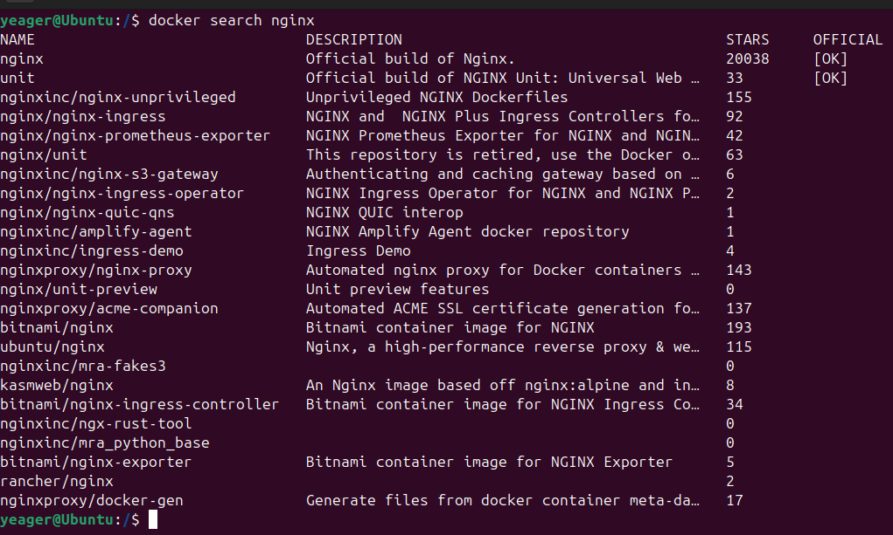
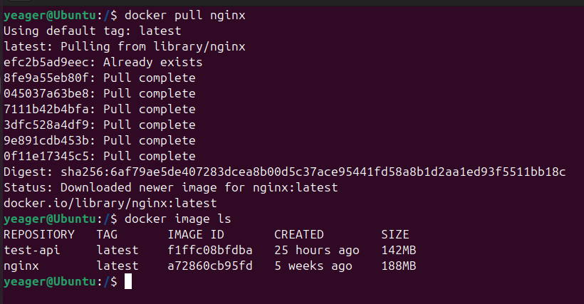
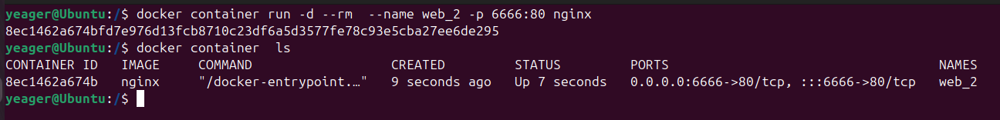

# DevOps
## 24- 51 arası sorular

24.Adım: DevOps kültür felsefesi nedir?  DevOps açılımı ?
---

  > Geliştirme ve Operasyon ekiplerinin birlikte çalışmasını sağlar. Ortaya çıkan işbirliği, daha hızlı ve daha kaliteli üretimler elde etmeyi amaçlar.DevOps'un araçları ve uygulamaları, böyle bir kültür olmadan çok az fayda sağlayacaktr.  DevOps kültürünün merkezinde işbirliği, sistem düzeyinde düşünme ve geri bildirim döngüleri yer alır. Bu temel unsurlar DevOps'un üretim hızını ve kalitesini sürekli olarak iyileştirmesini sağlar.
---


25.Adım : DevOps  açılımı nedir?
---

  > Geliştirme (Dev) ve operasyonların (Ops) birleşimi olan DevOps müşterilere sürekli olarak değer sunmak için bir araya gelen kişiler, süreçler ve teknolojiler bütünüdür.
---


26.adım: DevOps Yöntemlerinden Continous /Continoues Delivery-Deployment süreçler hakkında bildilerimizi yazalım.
---
  > Continoues Delivery, yeni gelişmeler yapılan ynei kod paketinin CI sürecinden geçtikten sonra build alınıp depoyle hazır hale gelmesini sağlar.

  > Continoues Deployment, hazır hale gelmiş yeni paketin sunuculara kurulmasını sağlayan aşamadır.
----


27.Adım: DevOpsYöntemlerindengitnedir?
---
  > Git (global information tracked) ücretsiz ve  dağıtık bir versiyon kontrol  yönetim  sistemidir.

---


28.Adım: DevOps yöntemlerinden  Agile nedir? 
---
  > Agile ve DevOps, yazılım geliştirmenin tüm yönlerine verimlilik ve öngörülebilirlik katan iki tamamlayıcı uygumadır.Agile metodoloji iş birliğine, hızlı yazılım               sürümlerine ve müşteri geri bildirimine odaklanan yinelemeleli bir yazılım geliştirme yaklaşımıdır.

----


29.Adım: DevOps Continues monitoring nedir?
---
  > DevOps süreçlerinde uygulama ve sistemlerin performansını, güvenliğini ve sürekliliğini takip etmeyi eder. Bu süreçte herhangi bir sorun tespit edilip hızlı bir şekilde       çözülmesi sağlanır.

---

30.Adım: Aşağıdaki içeriklerin açılımları ve neolduğunu yazalım?
---

* XML nedir?

  **XML(Extensible Markup Language)
  
  > Genişletilebilir İşaretleme dili, hem insanlar hem de bilgisayar sistemleri tarafından kolayca okunabilen belgeler oluşturmak için kullanılan bir metin  işaretleme           dilidir.  Veri yapılarının ve veri içeriklerinin tanınmmlanması için bir standart sağlar.

* JSON nedir?
 
   **JSON(JavaScript Object Notation)
  
  > Basit veri yapılarını temsil etmek için tasarlanmış hem insanlar hem de bilgisayar sistemleri tarafından okunabilen  bağımsız bir veri değişim formatıdır.JavaScript;         nesne gösterimi, anahtar/değer çiftlerine ve sıralı listelere dayanan yapılandırılmış verilerin şemasız, metin tabanlı bir temsilidir.


* Yaml nedir?
 
    **YAML(Yet Another Multicolumn Layout)

  > Hem insan tarafından kolaylıkla okunabilen hemde sayısal olarak kolaylıkla işleme alınabilen ve tüm progamlama dilleri tarafından kullanılabilen  bir veri serileştirme  dilidir.

* http nedir?

  **HTTP(Hypertext Transfer Protocol)
  
  > İnternet üzerinde veri iletilmesi sağlayan bir protoldür.Web tarayıcıları ile web sunucuları arasında veri alışver,i, sağlar. HTTP, istemci-sunucu mimarisi temelinde         çalışır.


* Server nedir?

  **Server(Sunucu)

   > Bilgisayar ağı üzerinden diğer cihazlara hizmetlere, veriler veya kaynaklar sağlayan merkezi bir bilgisayardır. Sunucular, istemcilerden gelen istekleri işler ve bu           isteklere göre yanıtlar gönderir.
    

  

* Java JDK,JRE,JVM nedir?

    **JDK(Java Development Kit)
  
    >Java uygulamalarını geliştirmek için kullanılan bir gereken tüm raçları içeren  geliştirme ortamıdır.JRE ve API ler gibi programlama araçlarını içerir. Java kodu için belge oluşturmak için kullanılan Javadoc gibi diğer geliştirme araçlarını da içerir.


    **JRE(Java Runtime Enviroment )
  
     >Java uygulamasının yürütülmesini destekleyen yazılım araçları ve kitaplıkları içeren sanal bir ortamdır. JRE, Java programlarını ve uygulamarıını  yürütülmek üzere JVM        ye yüklemekten sorumludur. JDK nin bir parçasıdır.

    **JVM(Java Vitrual Machine)
   
     >Java bytecode unu yürüten bir yazilim motorudur. Java programlarını platformdan bağımsız bir şekilde çalıştırır. JRE nin bir parçasıdır.


---


31.Adım: Maven nedir? maven de clean install görevi nedir?
---

  > Java platformlarında proje yönetim ve inşa aracıdır. Projelerin yapılandırmasını, derlemesini, paketlemesini ve bağımlılık yönetimini otomatikleştirir. 

```
mvn clean package -DskipTest
```

 * Clean: Önceki derleme sonuçlarını ve geçici dosyaları temizler. Derleme sırasında oluşan target klasöründeki tüm dosyaları siler.
 
 * Install: Bir projeyi derleyip test ettikten sonra, projeyi yerel Maven deposuna (.m2/repository) yükler. Bu sayade projenizin derlenmiş çıktılarının ve bağımlılıklarının yerel sistemde kullanılabilir olmasını sağlar.

---

32.Adım: Docker nedir ? Docker Daemon, Docker CLI ne iş yapıyor ?
---

  > Docker, konteynerleştirme teknolojisini kullanarak uygulamaların ve onların bağımlılıklarının taşınabilir, izole edilmiş ortamlar içinde çalıştırılmasını sağlar. Docker, geliştiricilerin uygulamalarını bir "container" içinde paketlemelerine ve bu konteynerleri herhangi bir ortamda çalıştırmalarına olanak tanır. Bu sayede, uygulama her yerde aynı şekilde çalışır, böylece "çalışıyor ama benim bilgisayarımda" sorunu ortadan kalkar.


Docker Daemon

> Docker'ın temel bileşenlerinden biridir ve Docker container  ve image ların  yönetimini sağlayan bir arka plan hizmetidir. Docker istemcisi ile Docker Daemon arasında bir REST API aracılığıyla iletişim kurulur. Docker Daemon genellikle bir sistem hizmeti olarak çalışır ve yapılandırılabilir.

Docker CLI (Commond Line Interface)

> Komut satırı üzerinden Docker işlemlerini gerçekleştirmek için kullanılır.Bu sayede kullanıcılar Docker Daemon ile etkileşimde bulunarak  Docker container larını ve image larını  yönetebilir. Docker CLI, kapsamlı komut seti ve otomasyon yetenekleriile Docker ekosisteminin temel bileşenlerinden biridir.

---


33.Adım: Aşağıdaki adımları teker teker yazalım?
--- 
* 34.Adım:
  ```
  docker search nginx  
  ```
  > Dockerhub  da  "nginx" adında imagı arar ve arama sonuçlarını detaylı şekilde listeler

   

  ---
* 35.Adım:
  ```
  docker pull nginx
  ```
  > Docker Hub dan "nginx"  local makinenize indirir ve kullanıma hazır hale getirir.

    
  
---
  
36.Adım: nginx i  aşağıdaki  özelliklere sahip containerlar oluşturulalım. 
---

  * 80 portundan 6666 portuna yönlendiren (-p 80:6666),

  * Arka planda çalışan(-d),

  * Yeni adı web_2 (--name),

  * Container kapatıldıktan sonra silinen  (--rm).

```
docker container run -d --rm  --name web_2 -p 6666:80 nginx

```
 
  


---

37.Adım: Bu github adresindeki veriyi github ile clone yapalım. ve yapılacakları aşağıda yazılmıştır.
---
  * git clone URL_ADDRESS

  * Bu JAR dosyasının Dockerfile ve docker-compose.yml yazarak image oluşturalım.

  * Bu oluşturduğunuz image kendi dockerHub'ta repository'a pushlayalım.

  * Kendi repository gönderdiğiniz bu image docker pull … diyerek tekrardan local bilgisayarına veriyi alalım

---

38.Adım: SonarQube nedir ?
---

---

39.adım: Derlenmiş bir kodun statik kod analizini yapalım. (Çalıştırdınız sayfanın ana görünütüsünü görelim)
---

---

40.Adım: Bu statik kodlarda smell code, loop, port vs hataları ekran görüntsünü görelim.
---

---

41.Adım: GitLab nedir ?
---

> Web tabanlı bir Git depo yönetim uygulamasıdır. CI/CD (Continuous Integration/Continuos Deployment), hata kayıt, kod gözden geçirme ve viki desteği bulunur. Kapsamlı bir araç seti sunar.


---


42.Adım: CI/CD nedir ?
---

* CI (Continuous  Integration)
  > Sürekli Entegrasyon, yazılım geliştirme süreçlerinde kullanılan bir yaklaşımdır. Kod değişikliklerinin entegrasyonunu otomatikleştirerek yazılım  geliştirme sürecindeki hataları daha erken tespit  etmek ve daha yüksek verimlilik sağlar

* CD (Continuous Deliver/Continuous Deployment)
  
  **Continuous Delivery(Sürekli  Teslimat)
  
  > Derleme aşamasından sonra tüm kod değişiklerini otomatik olarak bir test ve/veya üretim ortamına dağıttığı için continuous integration bir uzantıdır.Genellikle bir insan onayı gereklidir.


  **Continuous Deployment(Sürekli Dağıtım)
  
  > Sürekli teslimattan bir adım daha ileri gider. Bu uygulamayla üretim hattındaki tüm  aşamalarını geçen her değişiklikler yayınlanır.İnsan müdahalesi yoktur ve yalnızca başarısız bir test yeni bir değişikliğin üretime dağılmasını engeller.

---

43.adım: GitLab Runner nedir ?
---

  > GitLab CI/CD  ile  oluşturduğumuz job ları çalıştırmak ve çıktılarını  GitLab a geri göndermek için kullanılan open source bir bileşendir. Çeşitli ortam ve platformlarda çalışabilir ve işlerin 
otomatik  olarak yönetilmesini sağlarken, yapılandırılabilir ve özelleştirilebilir olmasıyla iş akışlarının kolaylaştırılasını sağlar.

---

44.Adım: SSH nedir ?
---

   SSH(Secure Shell)
  >  Bilgisayar ve sunucu arasındaki güvenli bağlantının oluşmasını sağlayan bir protokoldür.Özellikle  şifreli bir bağlantı sağlayarak, uzak  bir sunucuya veya cihaza güvenli bir şekilde bağlanmanıza  ve komutlar çalıştırmanızı sağlar.

---

45.Adım: GitLab ve GitHub SSH-keygen oluşturarak bilgisayarına bağlayın?
---

---

46.Adım: Prometheus nedir, Jenkins nedir ?
---
Prometheus

  > Sistemlerin ve uygulamaların performansını izlemek, verileri analiz etmek ve sorunları erken tespit etmek içi kullanılan, go diliyle geliştirilmiş bir izleme (monitoring) ve uyarı (alerting) sistemidir.


Jenkins
  
  > Yazılım geliştirme süreçlerinde sürekli entegrasyon ve sürekli dağıtım (CI/CD) süreçlerini otomatikleştiren   java dilinde yazılmış açık kaynaklı bir  araçtır. Tekrarlayan görevleri otomatikleştirerek uygulama geliştirme, test etme ve dağıtma süreçlerini hızlı ve güvenilir bir şekilde gerçekleştirmeyi sağlar.

---

47.adım: Ansible nedir ?
---

---

48.adım: Kubernatesnedir ?
---

---

49.adım: Datadog Monitoring nedir ?
---

---

50.adım: Kanban nedir ?
---

---

51.adım: Scrum, Kanban ve waterfall nedir ?
---

---
