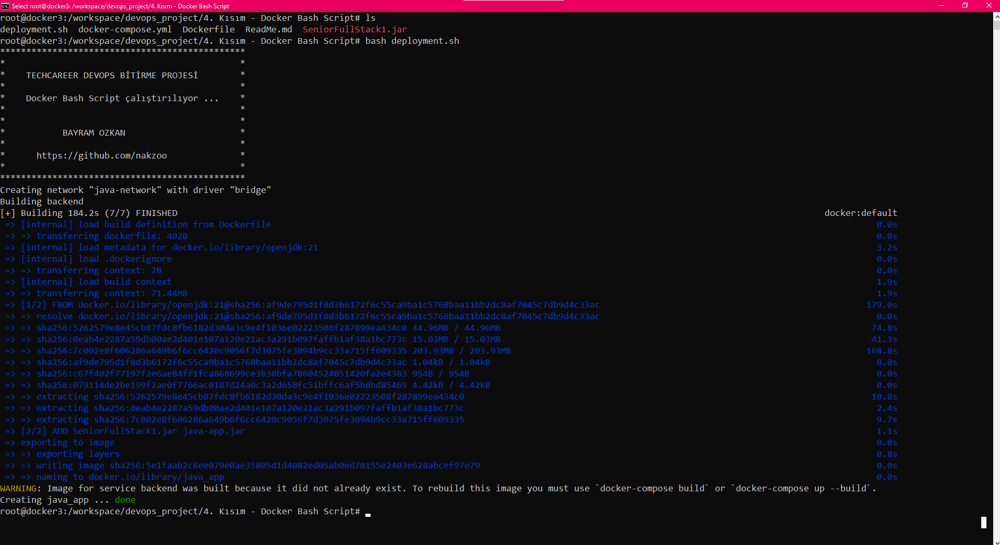
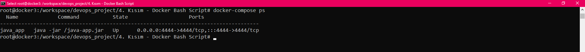
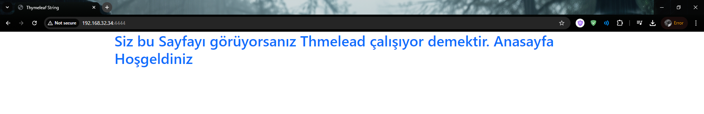

# Docker Bash Script

## Linux'ta çalıştırmak üzere deployment.sh yazıyorsunuz.
---

docker-compose.yml ve Dockerfile (daha önceden yaptığımız java uygulamasının dockerize bu bash scriptte ayağa kaldırıyoruz.)
---


* depyloymen.sh dosyamızı çalıştırıyoruz.

```
bash deployment.sh
```

 

----

* Java uygulamızı kontrol ediyoruz.

```
doccker-compose ps
```

 

----


 
