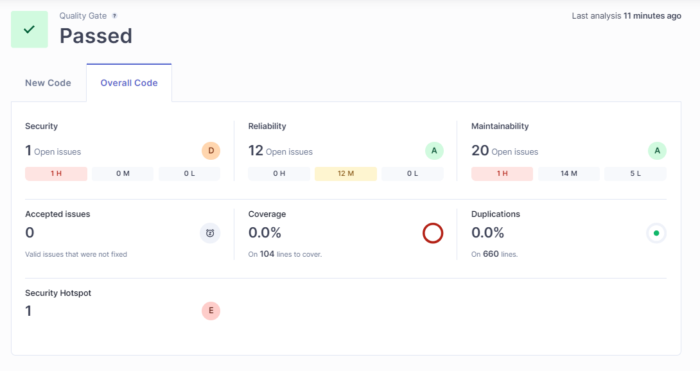

# Docker-compose & SonarQube
---

  * Docker compose üzerinden;

  * Postgresql, Sonarqube kuruyorsunuz.

  * Bir Java dosyasının maven komutu oluşturup(hazır kodlarda alabilirsiniz), sonarqube maven komutuyla çalıştırıp java kodlarındaki smell-code, güvenlik açıklarını kontrol ediniz.

## Docker compose üzerinde  Postgresql ve SonarQube kurulumu .

Taramada kullanılan Java projesi [Zamann Çizelgesi Sistemi ](https://github.com/semasahinbay/zaman-cizelgesi-sistemi-backend).

 

 
## Java projesinin sonarqube maven komutuyla çalıştırılması.

 

 ## Java projesindeki  smell-code, güvenlik açıklarının kontrolü. 

 * Tarama sonuçları
   
  

  

  * Smell-code

      

  * Vulnerability
    
     
       
  
     
