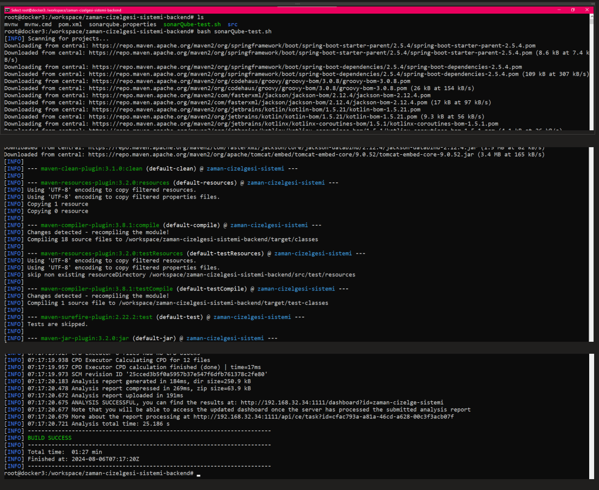

# Docker-compose & SonarQube
---

  * Docker compose üzerinden;

  * Postgresql, Sonarqube kuruyorsunuz.

  * Bir Java dosyasının maven komutu oluşturup(hazır kodlarda alabilirsiniz), sonarqube maven komutuyla çalıştırıp java kodlarındaki smell-code, güvenlik açıklarını kontrol ediniz.

## Docker compose üzerinde  Postgresql ve SonarQube kurulumu .

 

 
