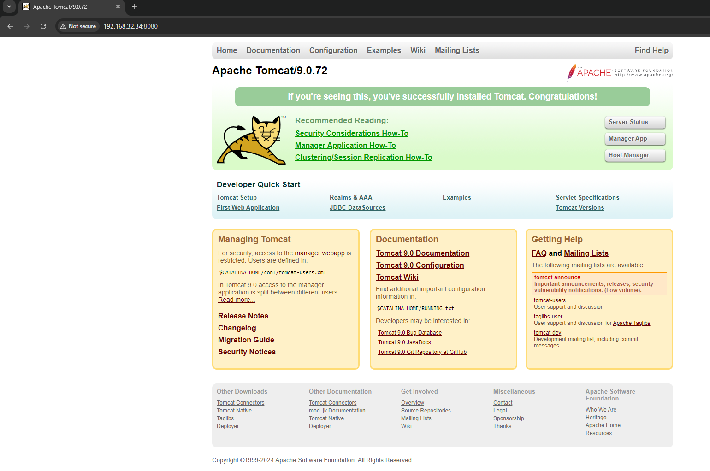

#  Apache Tomcat

* Apache Tomcat Ubuntu işletim sisteminde kurulacak şekilde bashscript yazınız ?

* Apache Tomcat Docker üzeriden çalıştırmak için Dockerfile, docker-compose.yml yazınız ve image adını apache_tomcat_deploymeny yazınız ?

  ** Step-1 Apache_tomcat_deployment adındaki image adı kendi dockerhub’ınıza gönderiniz (push)
	

  ** Step-2 Apache Tomcat için Jenkins üzerinden deployment yapınız ?


Apache Tomcat script
--

  

---


Tomcat kurulum kontrolü
---

```
systemctl status status tomcat9
```

  

---

  
